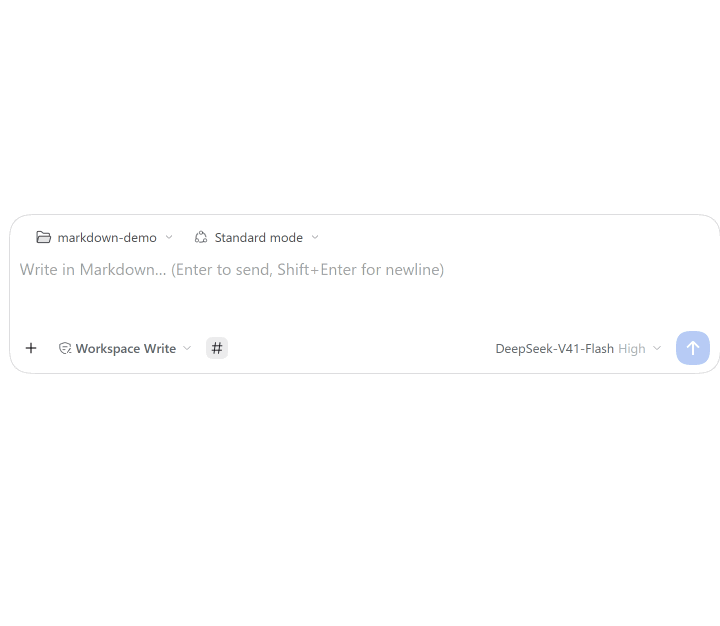
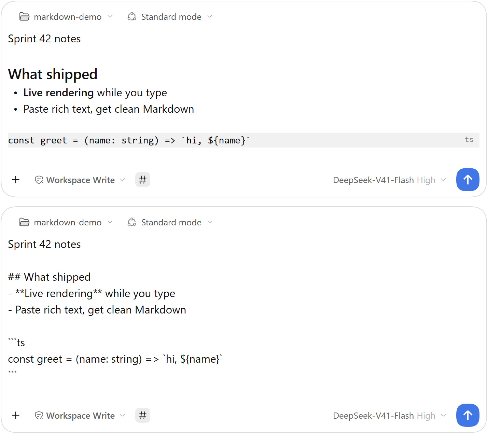
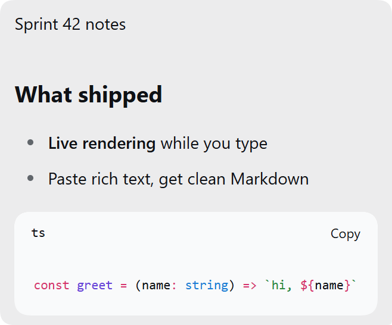
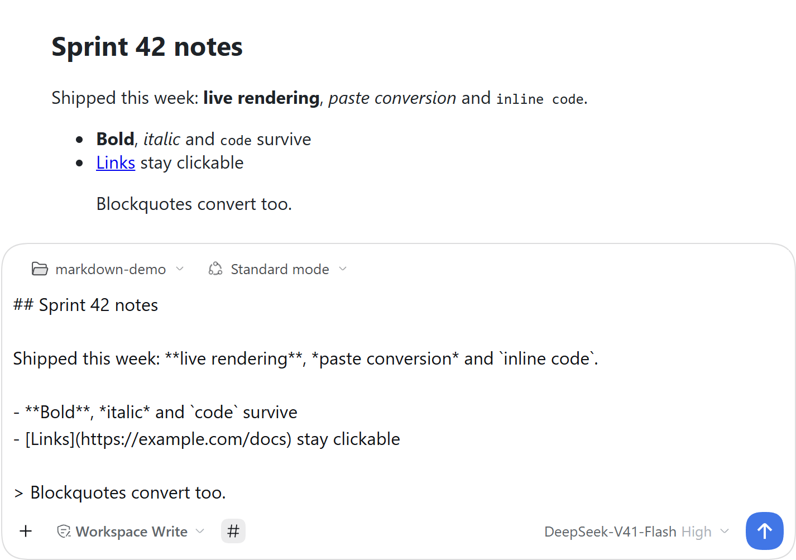

# dsh-markdown-input

[English](README.md) | 简体中文

[](https://github.com/long6177/dsh-markdown-input/actions/workflows/ci.yml)
[](https://www.npmjs.com/package/dsh-markdown-input)
[](LICENSE)

一个 [DeepSeek Harness](https://github.com/deepseek-ai/deepseek-harness)（`dsh`）插件。为了让用户在使用 dsh 输入提示词时能更清晰地组织语言与思路，我们提供以**输入区 Markdown 实时渲染**为核心的能力——敲下的就是发出去的，看到的也是敲下的。

> **状态：alpha，积极开发中。** dsh 本身处于 developer preview，版本之间存在破坏性变更——哪些组合真正在真机上验证过，见[兼容性](#兼容性)。



## 它做什么

### 输入区实时渲染

经宿主 `conversation.composer` 选举链的低优先级条目（[ADR-0005](docs/adr/0005-composer-revival.md)），输入区由自带的 CodeMirror 6 编辑器接管，Obsidian Live Preview 式：粗体、斜体、行内代码、删除线以真样式呈现，语法标记在光标离开所在行后折叠隐去；一键切换源码模式，所有标记保持原文可见。Enter 发送（中文 IME 安全）、`Shift+Enter` 换行，输入内容实时镜像进宿主草稿，页面刷新不丢。



### 用户消息 Markdown 化

已发送的用户消息与排队中的 steering 消息在聊天记录里按 Markdown 渲染——复用宿主自带的渲染管线——而不是一整面纯文本。`@` 提及与技能引用 chip 原样保留，你敲下的换行按硬换行保真呈现。



### 粘贴转 Markdown

从网页或文字处理软件粘贴富文本时，剪贴板的 `text/html` 自动转为干净的 Markdown——接管卡内落在光标处，原生输入区经宿主带版本守卫的插入 API 一步写入。`Ctrl/Cmd+Shift+V` 仍直插纯文本，纯文本、文件与图片粘贴的行为不变。



### 逐面降级

每个面激活前先探测宿主能力，失败即独立降级：内置接管面板（审批、提问、子代理）优先级更高，需要输入区时照常抢占；宿主面缺失时只失去对应功能，文本面永不下线；卡级 error boundary 在渲染异常时静默回落原生输入区，草稿不丢。

## 安装

前提：装有 Web UI 的 dsh（官方桌面端）。已验证到 dsh `0.2.0-rc.2`——装在更新的 dsh 上之前，先看[兼容性矩阵](#兼容性)。

```sh
dsh plugin --profile web add dsh-markdown-input
dsh plugin --profile web add github:long6177/dsh-markdown-input
```

## 兼容性

本项目不做范围承诺，只维护一张实测矩阵——真机真实跑过的组合，带日期与结论——外加一道常驻的上游漂移监视。

| dsh 版本 | 验证过的插件版本 | 最近真机验证 | 结果 |
|---|---|---|---|
| `0.2.0-rc.2` | `0.2.0-alpha.0` → `0.2.0-alpha.20` | 2026-10-07 | 通过 |
| `0.2.1-alpha.1` | — | — | **未验证** |

- 迄今每一次 npm 发布——`0.2.0-alpha.0`（2026-10-02）到 `0.2.0-alpha.20`（2026-10-07）——都在运行 `0.2.0-rc.2` 内核的官方桌面端上重测过。每次发布附带一份验收清单，逐版本索引与日期见 [docs/release/README.md](docs/release/README.md)。
- 上游已发布 `0.2.1-alpha.1`。本插件的 peer range 是 `^0.2.0-rc.2`（见 [package.json](package.json)）；按 semver 预发布规则，该范围不接受 `0.2.1-alpha.1`。对它的验证由漂移监视触发（见下）；结果出来之前，不声称兼容该版本。
- **漂移监视。** 一个定时仓库工作流每天探测四路上游信号：npm registry（新版本与 dist-tag）、上游 Release 与 Tag、本插件所依赖契约路径上的提交、官方契约文档的提交。命中新版本即以该版本跑全套测试与 semver 检查，并按版本开一张跟踪 issue（标签 `upstream-drift`）。工作流只负责开 issue——不改代码，也不自行宣布兼容。

## 设计说明

这里是四行摘要，深文在 [docs/design/](docs/design/)：

- [为什么是接管](docs/design/why-takeover.md) —— 输入区路线的工程叙事（绘制层 → 接管 → 复活），以及当前扩展模型下的四条精确缺口，每条都有上游源码位置背书。
- [扩展点调研](docs/design/extension-points.md) —— dsh Web UI 允许插件触碰什么的源码级底册：槽位、composer 选举链、消息渲染器。
- [原生面重建规格](docs/design/native-surfaces-rebuild.md) —— 接管后需要自绘的工具行弹层逐件规格（命令菜单、权限预设、模型选择）。
- [主流产品对照](docs/design/prior-art.md) —— 主流聊天产品输入区对 Markdown 的处理行为，全部取材一手来源。

决策记录（编辑器选型、接管、发布仪式、开发依赖模型）在 [docs/adr/](docs/adr/)。

**上游愿望清单。** 上述缺口对应五条具体的接口期望——视图层复用、原生座位在接管下幸存、正式接管契约与一致性套件、插件脚手架、preview 期的稳定性或弃用策略。成文在 [docs/design/why-takeover.md · 上游愿望清单](docs/design/why-takeover.md#上游愿望清单)，将作为 Discussions 的「Ideas」帖发布，供社区按 upvote 表达优先级。

<!-- post-publish: swap in the live Discussions URL -->

## 参与

[CONTRIBUTING.md](CONTRIBUTING.md) 写清了环境（多数工作不需要 dsh 桌面端）、哪些仍须真机验证，以及合并门槛：**测试全绿 + 维护者真机重测**。缺陷与功能建议走 [Issues](https://github.com/long6177/dsh-markdown-input/issues)（有模板）。成为共同维护者的路径也写在其中——这个项目想和大家一起维护，而不是一个人维护。

## 许可证

[MIT](./LICENSE)。本插件是社区作品——不是 DeepSeek 官方产品，与 DeepSeek 无隶属关系，也不为其背书。
